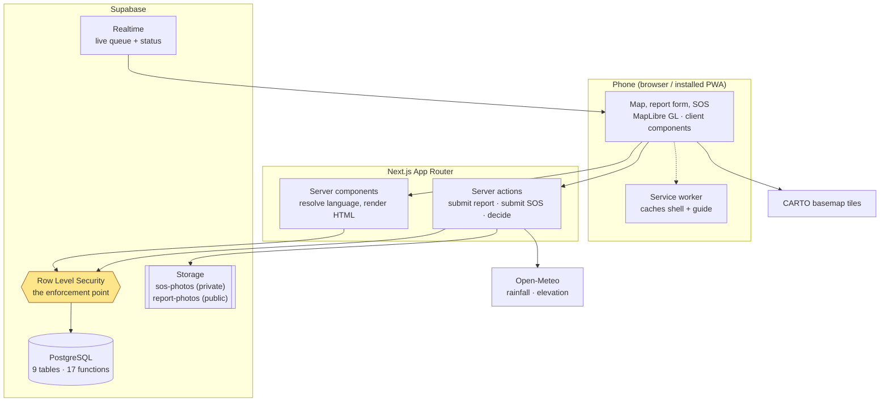
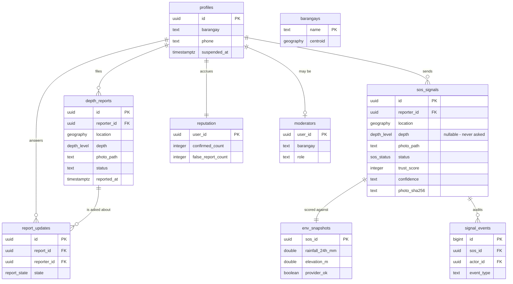
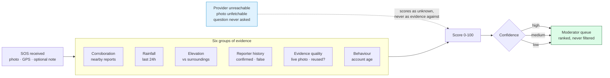
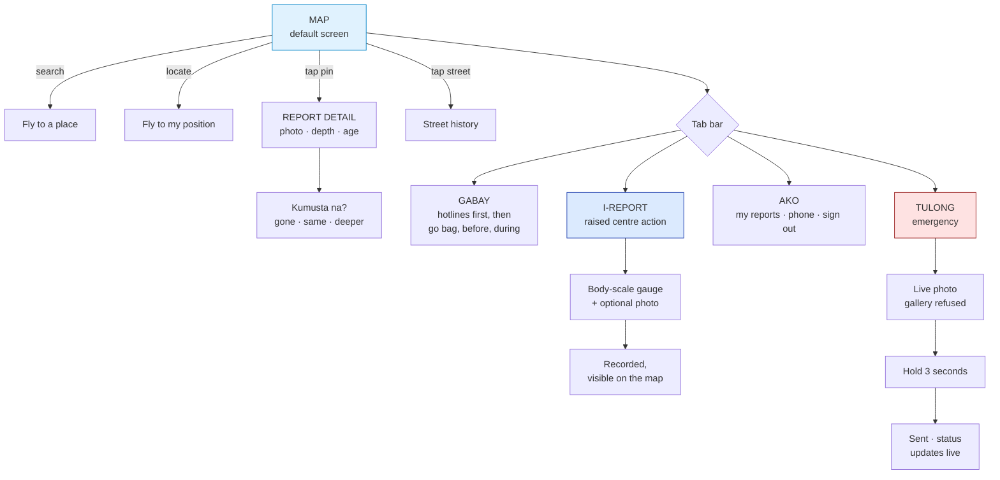

> ## ⚠ THIS FILE DOES NOT BUILD THE SUBMITTED DOCUMENT
>
> `build-docx.mjs` does **not** read this file. It carries its own copy of the
> prose inline, and that copy is newer and more complete than this one — it has
> numbered subsections, a literature review with eight citation slots, named
> personas, and a references section that this file lacks.
>
> **Editing prose here changes nothing in `Antas-Research-Report.docx`.**
> Prose edits go in `build-docx.mjs`.
>
> **Keep this file anyway.** It holds the only copy of the four mermaid diagram
> sources (Figures 1–4). The generated `.docx` has placeholders reading
> `[ Figure N — paste the rendered diagram here ]`, so those diagrams still have
> to be rendered from the blocks below and pasted in by hand.

# Antas — Street-Level Flood Depth Reporting for Metro Manila

**Empirical Software Innovation & Interface Prototyping**
Elijah Olores · Centro Escolar University

> **Draft note — remove before submission.** Every claim marked `[VERIFY]` needs
> a real source you have read. Do not submit an invented citation; they are
> checkable, and a fabricated reference is worse than a missing one. Section I is
> the only part depending on outside sources — II, III and IV are drawn from the
> system itself and are verifiable in the repository.

---

## Section I — Research Foundation

### Problem statement

During a flood, the question a Metro Manila resident actually needs answered is
narrow and local: **is the water on my street passable right now?** The
information available answers a different question.

Official warnings operate at the scale of a river basin or a city. `[VERIFY:
PAGASA's public warning products and their spatial granularity — cite the
official description of their bulletin levels.]` They are authoritative about
*rainfall and river level*, and silent about the 200 metres between somebody and
the main road.

The gap is filled informally, by neighbours posting photographs and text to
Facebook groups and Messenger threads. That channel is fast and genuinely
useful, and it fails in three specific ways:

1. **It is unstructured.** "Baha na dito" cannot be compared, sorted, or aged.
   Two posts an hour apart cannot be told apart for currency.
2. **It is not addressable by location.** A post attaches to a group, not to a
   coordinate, so a reader cannot ask "what is happening on *my* street".
3. **It has no notion of staleness.** A photograph from three hours ago looks
   exactly like one from three minutes ago, and floodwater moves in far less
   than three hours.

`[VERIFY: at least one peer-reviewed source on crowdsourced or participatory
disaster reporting. Real, findable starting points — read before citing:
PetaBencana.id (MIT Urban Risk Lab, crowdsourced flood mapping in Jakarta) and
the Ushahidi platform literature. Both are documented academically and are
directly comparable to this work.]`

`[VERIFY: one industry or government statistic establishing the scale of urban
flooding in Metro Manila — NDRRMC situational reports and MMDA flood-control
publications are the credible primary sources.]`

### Target audience

**Primary persona — the commuter deciding a route.** A resident of Marikina or
Taguig, on a phone, on mobile data, deciding within the next few minutes whether
to walk or ride down a particular street. Their pain point is not a lack of
weather information; it is that no available source is specific to the street
they are standing on.

**Secondary persona — the barangay disaster desk officer.** Receives reports of
people in distress and must triage them, with no way to judge which are
credible.

> **Honest limitation to state in the paper.** These personas are derived from
> the design constraints and the developer's own locality, **not** from formal
> user interviews. Say so plainly. A persona presented as research when it is
> really a designer's assumption is exactly the weakness a panel will find, and
> conceding it costs far less than being caught by it.

### Why existing tools fail

| Tool | What it gives | What it cannot answer |
|---|---|---|
| PAGASA bulletins | Authoritative rainfall and river levels | Whether *this* street is passable |
| News and broadcast | City-scale, delayed | Anything at street resolution |
| Facebook / Messenger groups | Fast, local, human | Unstructured, unsearchable by location, no age |

### Core value proposition

Antas turns informal Facebook-group behaviour into **structured, located,
time-stamped observations** — and refuses to become an emergency service while
doing it.

Three features carry that proposition:

- **A depth scale measured in body parts, not centimetres** — ankle, knee,
  waist, chest, above head. A person standing in water knows where it reaches on
  them; they do not know it is 63cm. The scale *is* the interface.
- **Every reading carries its age**, and the map refuses to draw data older than
  six hours rather than presenting it as current.
- **A hard boundary, stated on every relevant screen**: Antas reports water. It
  dispatches nobody. It says so on the guide, on the SOS screen, and on the
  shared link preview itself.

---

## Section II — Software Architecture & Purpose

### Feature set

| Feature | Purpose |
|---|---|
| Depth map | Reports as pins coloured by depth; deepest-first clustering |
| Report flow | Five-level body-scale gauge, optional photo, GPS accuracy check |
| "Kumusta na?" | Three-state freshness answers on an existing report |
| Tulong (SOS) | Live photo, three-second hold, no account required |
| Moderator console | Triage queue scoped to a barangay, with trust scoring |
| Gabay | Preparedness guide and hotline numbers, cached for offline use |
| Filipino / English | Whole-interface language toggle |

### Architecture

**Figure 1 — System architecture.**



Every path to data passes through Row Level Security. A moderator's barangay
scope, the confidentiality of a reporter's phone number, and the visibility of
SOS photographs are database predicates rather than application checks, so no
route can bypass them by accident — including a route added later by someone who
has not read this report.

- **Client:** Next.js App Router; React server components for content, client
  components for the map and interactive controls
- **Data:** Supabase — PostgreSQL with geospatial queries, Row Level Security,
  Storage for photographs, Realtime for live queue updates
- **Map:** MapLibre GL with CARTO basemaps; day/night basemap chosen by Manila
  clock time
- **Environment:** Open-Meteo for rainfall and elevation, used in trust scoring

**Nine tables** across **26 migrations**, and **17 database functions**.

### Data model

**Figure 2 — Entity relationships.** Key columns only; `profiles` extends
Supabase's `auth.users` rather than replacing it.



Two details in this diagram carry design decisions rather than mere structure.
`sos_signals.depth` is **nullable** because the emergency form stopped asking for
one — nobody in danger should be working a five-level selector. And
`signal_events` records a row every time a moderator so much as *opens* a signal,
which is what keeps the broad admin scope accountable.

### Workflow: the SOS trust score

The most substantial algorithm. A signal is scored from six groups of evidence:
corroborating nearby reports, recent rainfall, elevation relative to
surroundings, the reporter's history, evidence quality (including whether the
photograph has been submitted before), and behavioural signals such as account
age.

**Figure 3 — SOS trust scoring.**



**One principle governs the scorer, and it is the paper's strongest design
argument:** a gap in the system's knowledge is never scored as evidence against
the person asking for help. An unreachable weather provider, an unfetchable
photograph, or a question the sender was never asked all score identically to a
clean result. The system ranks signals it knows less about lower; it never
refuses one.

The distinction matters in practice. An SOS is no longer asked for a depth, so
the two checks that exist only to *contradict* a claimed depth withdraw rather
than treating silence as a shallow claim — otherwise the system would penalise
people for a form field it had deliberately chosen not to show them, pushing the
fastest askers toward the bottom of the queue.

### Information hierarchy

**Figure 4 — Information hierarchy and core user journeys.** There is no
onboarding: the map is the first screen, and everything a first-time visitor
needs to read requires no account.



The map is the default screen because the product's premise is a question about
a place. Reporting is a raised centre action rather than a peer tab because it
is the single contribution the system asks for. Tulong sits in the tab bar but
is coloured unlike its neighbours — reachable by a plain labelled tap, because
an emergency path hidden behind a gesture cannot be discovered by somebody who
needs it now.

---

## Section III — Design Prompt & Rationale

> **Fill in from your own history.** Replace the prompts below with the exact
> text you used if you still have it. If not, these are written to reproduce the
> screens the application actually has — run them, then quote what you ran.

### Prompt 1 — Context and constraints (the framing prompt)

```
Design a mobile-first flood reporting app for Metro Manila residents.

CONTEXT: Users open this during heavy rain, one-handed, on a phone, outdoors in
daylight, often on poor mobile data. Many are deciding within seconds whether a
street is safe to walk down.

CONSTRAINTS:
- Light interface only. It is read outdoors in daylight; dark mode is a
  liability here, not a feature.
- No decorative illustration, no gradients, no glassmorphism. This is a safety
  tool.
- All primary navigation reachable by thumb at the bottom of the screen.
- Filipino-first labels.
- Minimum 48px touch targets.

DO NOT include: rescue dispatch, evacuation orders, official authority badges,
or any label implying floodwater is safe.
```

**Rationale.** The negative constraints do the real work. An unconstrained
generator reaches for the visual language of emergency dashboards — sirens,
alerts, authority — which this system has no right to use. Stating the
prohibitions in the prompt is cheaper than rejecting the output afterwards.

### Prompt 2 — The map screen

```
Screen 1 — Map. Full-bleed map filling the viewport. Floating search field
pinned to the top. Bottom tab bar with five items: Map, Guide, Report (raised
circular centre button), Me, Help. A compact legend showing five water-depth
levels from ankle to above-head, ordered deepest first. A weather chip. No
header bar — the map is the content.
```

**Rationale.** Depth is ordered deepest-first so the legend reads as a warning
rather than a neutral scale. The header is omitted because on a phone three
stacked bands of chrome consume roughly a fifth of the screen before the product
appears.

### Prompt 3 — The report flow

```
Screen 2 — Report water depth. A large vertical selector with five options
labelled by body part: ankle, knee, waist, chest, above head. Each option has a
distinct colour from pale blue to deep purple. A human figure beside the list
showing where the water reaches. Optional "add photo" card below. One primary
submit button.
```

**Rationale.** The scale is a body because the measurement is taken against a
body. A centimetre field would ask the user to convert something they perceive
directly into something they must estimate.

### Prompt 4 — Iteration

```
Refine: reduce the card treatment. Too many surfaces are raised, which flattens
the hierarchy. Keep cards only where content is genuinely grouped, and let the
depth colour ramp run edge to edge in the selector.
```

**Rationale.** The first generation applied card containers uniformly. When
everything is elevated, nothing is emphasised — the depth ramp, the most
important information on the screen, was competing with its own container.

---

## Section IV — Reflection & Usability Evaluation

### Where the generated interface aligned well

Several Stitch proposals were adopted essentially unchanged, and each solved a
real problem:

- **Place search.** The map opens over the whole of Metro Manila while the user's
  question is about one street. Before search, answering it began with a pinch
  across the region.
- **A bottom tab bar.** Correct for one-handed phone use, and it moved navigation
  out of the header entirely.
- **"My reports."** A submitted report previously vanished into the map, with no
  way to see or withdraw a contribution.
- **A locate button.** Search answers "take me to Malanday"; this answers "take
  me to *me*", which is the more common question.

### Where the generated interface was actively unsafe

**This is the finding worth reporting.** Several generated proposals were
plausible, well-composed, and would have caused harm. Each was rejected, and the
reason was the same every time: *they assumed an authority relationship, or live
operational data, that the system does not have.*

| Generated proposal | Why it was refused |
|---|---|
| Official alert broadcasts with forced-evacuation orders | An evacuation order is an instruction only an authority may issue |
| Evacuation centre capacity ("60% Puno") | Being wrong sends a family through floodwater to a full centre. Capacity is not ours to know |
| "VERIFIED AUTHORITY" badges on posts | Impersonates an institution the project has no relationship with |
| A "Ligtas" (safe) label on ankle-deep water | No flood depth is safe. Ankle-deep water hides open drains and moves fast |
| Satellite basemap with filled heat zones | Claims continuous area knowledge derived from sparse point reports |
| Free-text comments under a report | Nobody moderates this app; "wala na po" could sit beneath chest-deep water |

### What this says about AI-assisted interface design

The generator was reliably good at **conventions** — where controls belong, what
a mobile flood app usually contains, how to structure a tab bar — and reliably
unable to distinguish **what the system is entitled to claim**. It proposed an
authority badge and a capacity indicator with exactly the same confidence as it
proposed a search field, because visually they are all just components.

The judgement separating them is not a design skill. It is knowing what data the
system actually holds and what it may honestly assert — which the tool cannot
know, and which no prompt reliably supplies.

**The practical conclusion:** AI interface generation was most valuable for
layout and convention, and required a domain-informed reviewer with the
authority to refuse. Two of the refusals above — the "Ligtas" label and
free-text comments — would have passed an ordinary usability review. They fail
only against the question *"what happens if this is wrong while somebody is
standing in water?"*

### Usability evaluation against the target user

| Requirement | Outcome |
|---|---|
| Readable outdoors in daylight | Light interface on all task pages; map follows the Manila clock |
| Usable one-handed | All navigation in a bottom tab bar; 48px minimum targets |
| Usable on poor connectivity | Shell and guide cached; map keeps its last snapshot and always states its age |
| Usable with no account | SOS requires none; map and guide require none |
| Readable by non-Tagalog speakers | Full Filipino/English toggle, with no partial translation |

**Remaining limitations**, stated rather than hidden: barangay granularity is
uneven outside Marikina, Taguig and the City of Manila; the hotline numbers were
supplied rather than independently verified; and the personas were not validated
through formal user research.

---

## Appendix — Verification

Claims in Sections II–IV are checkable in the repository at
`github.com/blckltsdmsnw/antas`: `docs/STATUS.md` records what was built and
why, `docs/design/design.md` §12 lists every refused feature with its reasoning,
and the test suite (388 unit, 60 end-to-end) encodes the safety rules as
assertions — including tests that the interface never promises rescue, in either
language.
